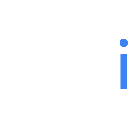
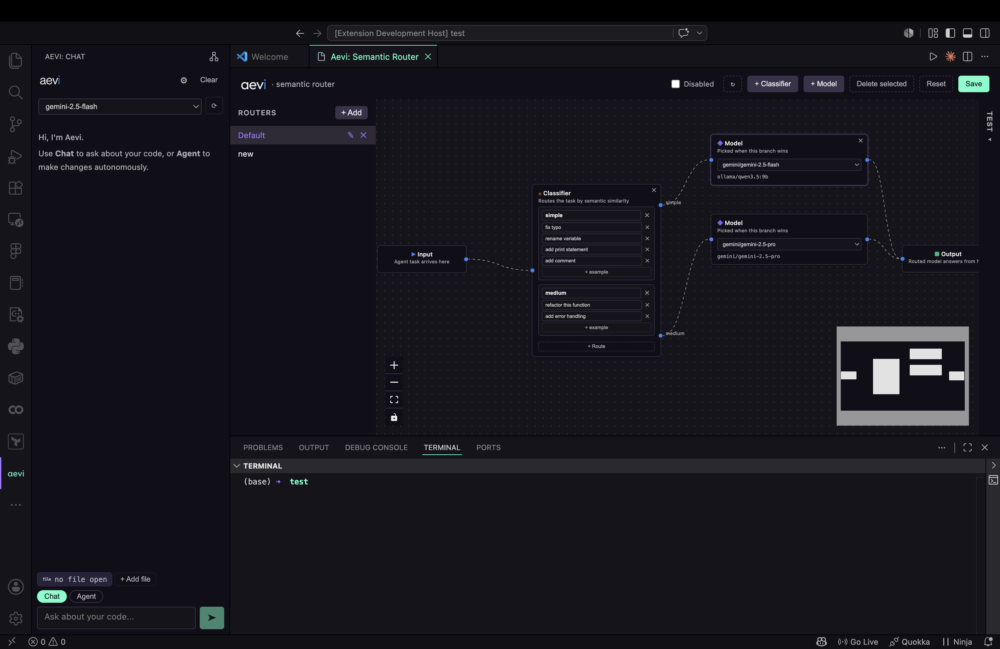

#  - AI Coding Assistant for VS Code

[](https://marketplace.visualstudio.com/items?itemName=NishithReddyP.aevi)
[](https://marketplace.visualstudio.com/items?itemName=NishithReddyP.aevi)
[](https://open-vsx.org/extension/NishithReddyP/aevi)
[](https://open-vsx.org/extension/NishithReddyP/aevi)
[](https://opensource.org/licenses/MIT)

**Aevi** is a powerful, flexible AI coding assistant extension for Visual Studio Code. Powered by a FastAPI and LiteLLM backend, it seamlessly bridges local and cloud-based Large Language Models (LLMs) to help you write, debug, and refactor code directly in your editor.


https://github.com/user-attachments/assets/474d528a-213a-453f-8e93-ad428e27c193


---

## ✨ Key Features

* 🔄 **Bring Your Own Model (BYOM):** Connect to local providers (Ollama, LM Studio, vLLM, llama.cpp) or premium cloud APIs (OpenAI, Anthropic, Gemini, Groq).
* 📚 **Workspace Indexing (RAG):** Automatically parses and vectorizes your codebase. Ask questions, and Aevi will retrieve the most relevant files and code chunks to provide highly contextual answers.
* 💬 **Real-Time Chat Streaming:** Fast, responsive chat UI built directly into the VS Code sidebar.
* 🤖 **Agentic Workflows:** Let Aevi analyze a problem, propose a multi-file solution, and apply writes directly to your workspace.
* 🧭 **Semantic Routing:** Build visual model-routing graphs that send each agent task to the right model based on its meaning — small/cheap models for trivial tasks, large/capable ones for complex work.
* 💻 **Cross-Platform:** Fully tested and operational across Windows, macOS, and Linux.

---

## 🚀 Installation (For Users)

1. Open VS Code and navigate to the Extensions view (`Ctrl+Shift+X` or `Cmd+Shift+X`).
2. Search for **Aevi**.
3. Click **Install**.
4. Alternatively, install it via the web from the [VS Code Marketplace](https://marketplace.visualstudio.com/items?itemName=NishithReddyP.aevi) or [Open VSX](https://open-vsx.org/extension/NishithReddyP/aevi).

---

## ⚙️ Configuration & Usage

1. Open the Aevi sidebar in VS Code.
2. Click the **Settings** icon.
3. **For Cloud Models:** Enter your API keys (OpenAI, Anthropic, Gemini, Groq). These are securely stored in VS Code's native SecretStorage.
4. **For Local Models:** Add your local provider URL (e.g., `http://localhost:11434` for Ollama).
5. Open a codebase, and Aevi will automatically begin indexing your files for RAG. Ask your first question!

---

## 🧭 Semantic Routing

Aevi lets you build **semantic routers** — visual graphs that pick the right model for each agent task based on what the task actually means, rather than forcing one model to handle everything. The editor is a ComfyUI-style node canvas: drag handles to wire nodes, edit classifier example phrases inline, pick a model per branch, and test prompts against the live graph.

<p align="center">
  
</p>

A router is a small directed graph with four node types:

| Node | Role |
| --- | --- |
| **Input** | The task entrypoint. Exactly one per graph. |
| **Classifier** | Branches the flow by semantic similarity. Each outgoing edge has a label and a set of example phrases. Incoming tasks are embedded and routed down the closest-matching branch. |
| **Model** | Pins a specific provider/model id. Whichever model node wins the routing wins the task. |
| **Output** | Visual sink for the graph. |

### Using the router

1. Open the router with **Command Palette → "Aevi: Open Semantic Router"**, or click the router icon in the chat panel's title bar.
2. Click **+ Add** in the left sidebar to create a new router — it starts with a `simple / medium / complex` classifier wired to three model slots, so you only need to pick the models you want for each branch.
3. Add more classifiers and model nodes from the toolbar; wire them by dragging between handles. Each classifier handle has an editable label and a list of example phrases that drive matching.
4. Pick a model for every terminal `Model` node from the dropdown (it shows every local and cloud model Aevi knows about).
5. Click **Save**, then toggle the router **Enabled**. The router shows up as an option in the chat panel's model picker — selecting it routes each agent task through the graph instead of pinning a single model.

### Testing without running an agent

The right-hand panel has a **Test a prompt** box: type a sample task and Aevi will embed it, walk the graph, highlight the matched path on the canvas, and tell you which model would have handled it — useful for tuning example phrases without spending tokens.

### Multiple routers

Each router lives in its own file under `~/.aevi/routers/<id>.json` and shows up as a separate entry in the model picker, so you can keep different routing strategies side-by-side (e.g. one tuned for refactors, one for documentation tasks).

---

## 🛠️ Architecture

Aevi is split into two main components:
1. **Frontend (VS Code Extension):** Built with TypeScript and a Webview UI. It handles the editor context, file tracking, and user interface.
2. **Backend (FastAPI Server):** A Python-based local server that manages model routing (via LiteLLM), the semantic-routing engine (embedding-based graph traversal), vector databases (for RAG), and the agentic logic. The extension automatically spins up this backend when activated.

---

## 🤝 Contributing

Aevi is an open-source project, and contributions are heavily encouraged! Whether you want to fix a bug, add a new feature, or improve the documentation, your help is welcome.

### How to Contribute
1. **Report a Bug:** Notice something broken? [Open an issue](../../issues) with a detailed description and steps to reproduce.
2. **Request a Feature:** Have an idea to make Aevi better? [Open an issue](../../issues) and use the "enhancement" tag.
3. **Submit a Pull Request:** * Fork the repository.
   * Create a new branch (`git checkout -b feature/amazing-feature`).
   * Make your changes.
   * Commit your changes (`git commit -m 'Add some amazing feature'`).
   * Push to the branch (`git push origin feature/amazing-feature`).
   * Open a Pull Request!

### Local Development Setup

**Prerequisites:** Node.js, Python3.11+, [uv](https://docs.astral.sh/uv/) (Python package manager), and VS Code.

```bash
# 1. Clone the repository
git clone [https://github.com/YOUR_USERNAME/aevi.git](https://github.com/YOUR_USERNAME/aevi.git)
cd aevi

# 2. Install extension dependencies
npm install

# 3. Install and build the Webview UI
# (Replace 'webview-ui' with the actual name of your frontend folder if different)
cd webview-ui
npm install
npm run build
cd ..

# 4. Set up the Python backend environment using uv
cd backend
uv sync  # Automatically creates the .venv and installs dependencies
source .venv/bin/activate  # On Windows: .venv\Scripts\activate
cd ..

# 5. Compile the VS Code extension (You should be in the extensions directory)
npm run compile  # or npm run watch to auto-recompile on changes


# 6. Launch the Extension:
Open the root aevi folder in VS Code and press F5 (or go to Run and Debug -> Start Debugging). This will open a new "Extension Development Host" window where you can safely test your local build of Aevi!
